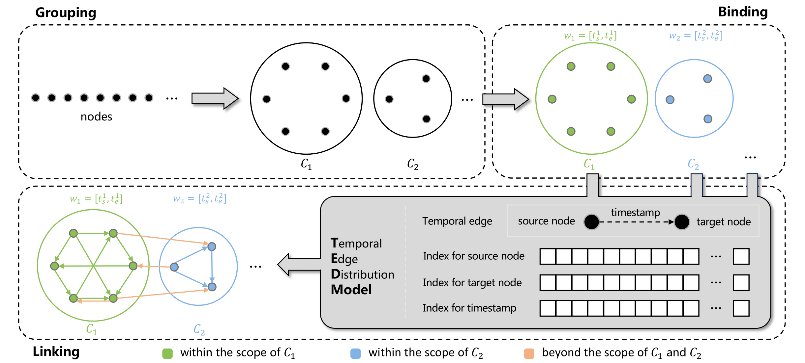

# GTB

**GTB** is a temporal graph **G**eneration method featuring **T**ime-**B**ound communities, the type of communities that is destined to disintegrate. To the best of our knowledge, GTB is the first work tempting on the generation of time-bound communities. 

As the following figure shows, the primary phases in operating GTB include (1) grouping nodes to distinct communities, (2) binding time windows to these communities, and (3) generating temporal links within and between each community. The core component supporting GTB is the Temporal Edge Distribution (TED) model, which can simulate user-defined distributions of temporal edges while keeping a low cost to build indexes, owing to its transferability from a time-bound community to another.



# How to use GTB?

#### Prerequisites:

* CMake version >= 3.18
* OpenMP

#### To run GTB:

1. Clone this repository:

   ```
   > git clone https://github.com/ukyotachibana0/GTB.git
   ```

2. The executable file `GTB` is already located at `bin` directory. In case you want to do some modifications to the source code, you can rebuild the project by the following commands in the project directory:

   ```
   > mkdir build
   > cd build
   > cmake ..
   > cmake --build .
   ```

   Then the executable file is outputted as `bin/GTB`.

3. Execute:

   ```
   > cd bin
   > ./GTB [config_filename] [store_dirname]
   ```

   , where `[config_filename]` is the name of the configuration file with the JSON format, and `[store_dirname]` is the name of the directory where you want to store the output datasets. For example, you can use the following command to generate an example graph:

   ```
   > ./GTB ../example.json .
   ```

#### To configure GTB:

GTB allows configuration in a JSON format. Primary keys in the JSON file include:

| Key                                                          | Description                                                  |
| ------------------------------------------------------------ | ------------------------------------------------------------ |
| `graph`                                                      | The name of the dataset.                                     |
| `node`                                                       | An array of multiple node types. Each type involves keys `label` and `amount`. |
| `node`-`label`                                               | The label of nodes for a node type.                          |
| `node`-`amount`                                              | The amount of nodes for a node type.                         |
| `edge`                                                       | An array of multiple edge types. Each type involves keys `label`,  `source`,  `target`,  `in`,  `out`,  `ts` (optional), and `community` (optional). |
| `edge`-`label`                                               | The label of edges for an edge type.                         |
| `edge`-`amount`                                              | The amount of edges for an edge type.                        |
| `edge`-`source`                                              | The label of source nodes for an edge type.                  |
| `edge`-`target`                                              | The label of target nodes for an edge type.                  |
| `edge`-`out`                                                 | The out-degree distribution w.r.t. source nodes for an edge type. |
| `edge`-`in`                                                  | The in-degree distribution w.r.t. target nodes for an edge type. |
| `edge`-`ts` (optional)                                       | The timestamp distribution for an edge type.                 |
| `edge`-`community` (optional)                                | The community configuration for an edge type. The keys in the community configuration involves `amount`, `delta`, `lambda`, and `overlap`. |
| `edge`-`community`-`amount`                                  | The amount of communities for an edge type.                  |
| `edge`-`community`-`lambda`                                  | The power-law distribution parameter for community sizes.    |
| `edge`-`community`-`delta`                                   | The time-bound community messing parameter $\delta$.         |
| <span style="white-space:nowrap;">`edge`-`community`-`overlap`</span> | The overlap configurations for time-bound communities associated with an edge type. The keys in the overlap configuration involves the number `m` of the overlap relationships, the minimum `min_omega` of the time-bound community overlapping parameter $\Omega$, and the maximum `max_omega` of the time-bound community overlapping parameter $\Omega$. |
| `store_format`                                               | The store format of the edges, including `TSV` and `ADJ`     |

If `ts` and `community` are simultaneously provided, a temporal graph featuring time-bound communities will be generated based on the configuration. Otherwise, a general graph will be generated.

The `example.json` in the project directory gives a concrete example of the configuration file to generate a temporal graph featuring time-bound communities.

```json
{
    "graph": "gt",
    "node": [{
        "label": "user",
        "amount": 10000
    }],
    "edge": [{
        "label": "follow",
        "source": "user",
        "target": "user",
        "amount": 80000,
        "in": {"type": "power_law", "lambda": 1.15, "min_d": 1, "max_d": 50},
        "out": {"type": "power_law", "lambda": 1.15, "min_d": 1, "max_d": 60},
        "ts": {"type": "power_law", "lambda": 1.15, "min_ts": 1, "max_ts": 5000},
        "community": {
            "amount": 4, "delta": 0.1, "lambda": 1.15,
            "overlap": {"m": 4, "min_omega": 0.01, "max_omega": 0.2}
        }
    }],
    "store_format": "TSV"
}
```

#### Output format:

The output files are stored in  `bin/[store_dirname]/[graph]` directory.

* `[source_label]_[target_label].[store_format]`: The edge file.

  * TSV format: 

    ```
    [source node ID]	[target node ID]	[timestamp]
    ```

  * ADJ format:

    ```
    [source node ID] [target node ID] [timestamp] ... [target node ID] [timestamp]
    ```

* `ground_truth.json`: The ground truth file records necessary information in the JSON format, such as time windows and node members of each time-bound community.